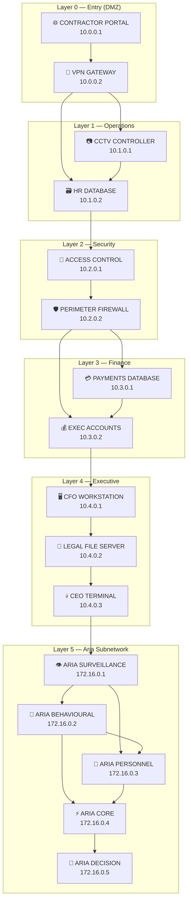

# Network Map

Visual overview of the 16 anchor nodes across 6 layers.

Edges show forward progression (entry → exit direction). Connections are bidirectional in the game engine.
The `exec_ceo → aria_surveillance` edge is gated by `aria_key.bin` (Layer 5 unlock).
